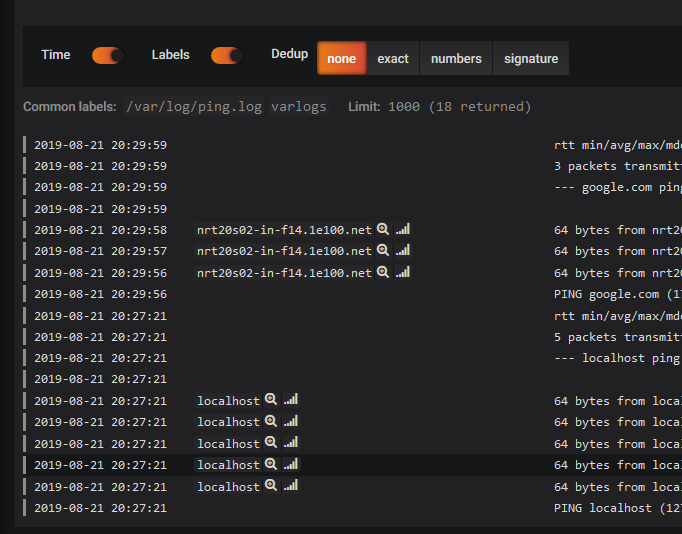

processing-log-lines を試す
---------------------------

## ping で表示されるリモートホストをラベルにしてみる

```
$ ping localhost
PING localhost (127.0.0.1) 56(84) bytes of data.
64 bytes from localhost (127.0.0.1): icmp_seq=1 ttl=64 time=0.090 ms
              ^^^^^^^^^ 
              ココをラベルにする
```

## promtail.yaml

```yaml
server:
  http_listen_port: 9080
  grpc_listen_port: 0

positions:
  filename: /tmp/positions.yaml

clients:
  - url: http://loki:3100/api/prom/push

scrape_configs:
- job_name: system
  static_configs:
  - targets:
      - localhost
    labels:
      job: varlogs
      __path__: /var/log/*log
  ## ↓↓追加↓↓
  pipeline_stages:
  - match:
      selector: '{filename="/var/log/ping.log"}'
      stages:
      - regex:
          expression: '^[0-9]+ bytes from (?P<remote>[a-zA-Z0-9\-\.]+) '   <--- ?P<remote> で抽出したのが
      - labels:
          remote:                                                          <--- remote ラベルになる
```

## grafana で確認

ping 打って

```
# ping localhost > /var/log/ping.log
# ping google.com > /var/log/ping.log
```

grafana で確認




## 参考

https://github.com/grafana/loki/blob/master/docs/logentry/processing-log-lines.md


